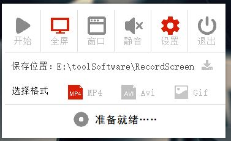

# 截图小工具


## 类库使用

PyQt5 

更多详见 [requirement.txt](./requirement.txt)


## 1.1版本更新

**修复bug:**

- 隐藏ffmpeg的命令行窗口
- 等待录屏处理结束后开始按钮才可以点击

**代码说明：**

隐藏窗口：

```python
st = subprocess.STARTUPINFO()
st.dwFlags = subprocess.STARTF_USESHOWWINDOW
st.wShowWindow = subprocess.SW_HIDE

在subprocess.Popen(startupinfo=st)
```


## 1.0版本更新

**修复bug：**

- 录制视频不流畅，帧数过低
- 双屏下不能录制不能截图

**新增：**

- 窗口模式下录制视频
- 截图功能

## 代码说明

移除Pillow和moviepy依赖

截图依赖转为：PyQt

```python
QApplication.primaryScreen().grabWindow(
            hwnd, pos[0], pos[1], size[0]-pos[0], size[1]-pos[1]).toImage()
```

**视频录制 ** 依赖FFmpeg

录制处理程序：FFmpegRecord.py (原版本修改为OpencvRecord.py)

Gif 录制思路变为：先录制视频，再用FFMpeg转gif.

### 遇到的坑：

- FFmpeg 录制屏幕

  - 全屏

    ffmpeg -f gdigrab -framerate {fps} -i desktop -s {width}x{height} -pix_fmt yuv420p -c:v h264 -b:v 2000k {path}

  - 截屏（宽度必须是32的倍数，高度必须是2的倍数）

    -f gdigrab -framerate {fps} -offset_x {x} -offset_y {y} -video_size {width}x{height} -i desktop -pix_fmt yuv420p -c:v libx264 {path}

- FFmpeg 转gif

  ffmpeg -i {src.mp4} -vf scale=360:-1 {out.gif}

- 开启subprocess执行ffmpeg命令

  使用process = subprocess.Popen()，后续可以给这个process写入‘q’来终止ffmpeg。

  ```python
  process.stdin.write('q')
  process.stdin.flush() # 不加不行
  # 一开始使用的是 process.send_signal(signal.CTRL_C_EVENT)
  # 但是ctrl+c把主线程都杀死了
  ```

  


## 0.8版本更新

### 功能项

- 全屏录制 
- 窗口录制
- 设置
  - 选择存储位置
  - 选择保存格式
- 退出




### 项目目录

- assets -- 资源目录
  - img -- 图片资源
  - icons.py -- icons.qrc生成的py文件
  - icons.qrc -- 资源文件
- components -- 组件目录
  - LabelButton.py -- 自定义按钮标签组件
  - Menu.py -- 菜单栏
  - Setting.py -- 设置栏
- ui -- 基础ui目录
  - Main_ui.py -- Main_UI.ui生成的py文件（主窗口）
  - Record_Window.py -- Record_Window.ui生成的（录制窗口）
- utils -- 处理工具
  - record.py -- 处理录制程序
  - Animation.py -- 动画处理程序
- view -- 视图目录
  - Main_View.py -- 主程序视图
  - Main_Window.py -- 基础窗口视图
  - Record_View.py -- 录制窗口视图
- main.py -- 程序入口

P.S.继承关系

Main_Window.py 继承于 Main_ui.py

Menu.py 和 Setting.py 继承于 Main_Window.py

Main_View.py 继承上面的两个组件

Record_View.py 继承于 Record_Window.py


